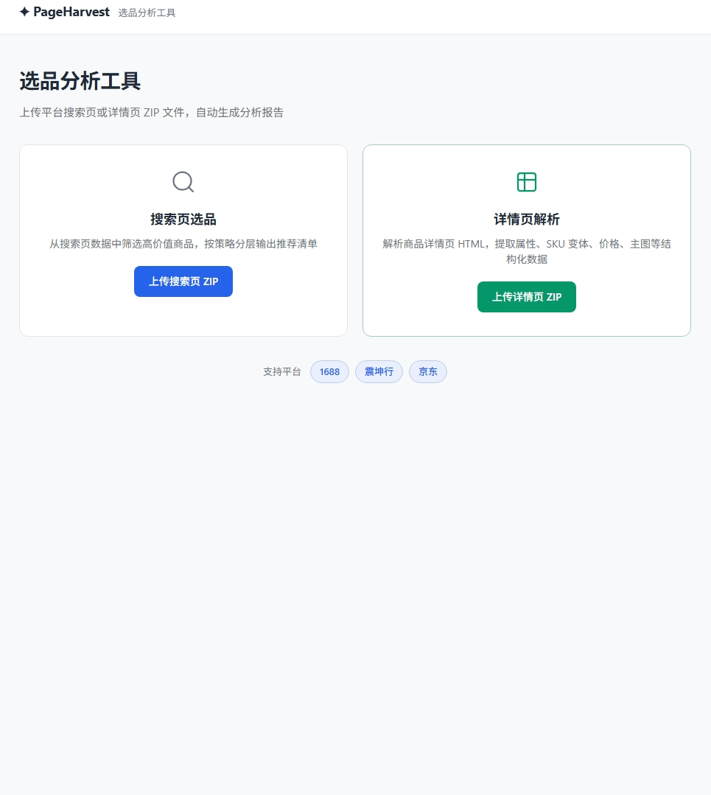
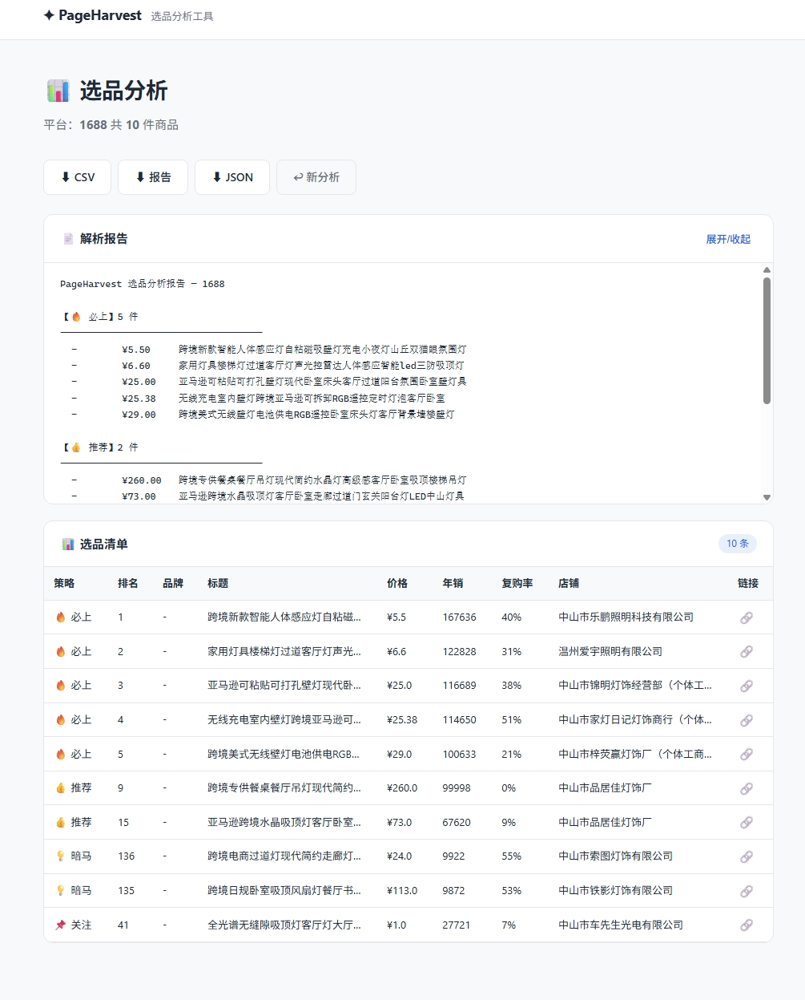
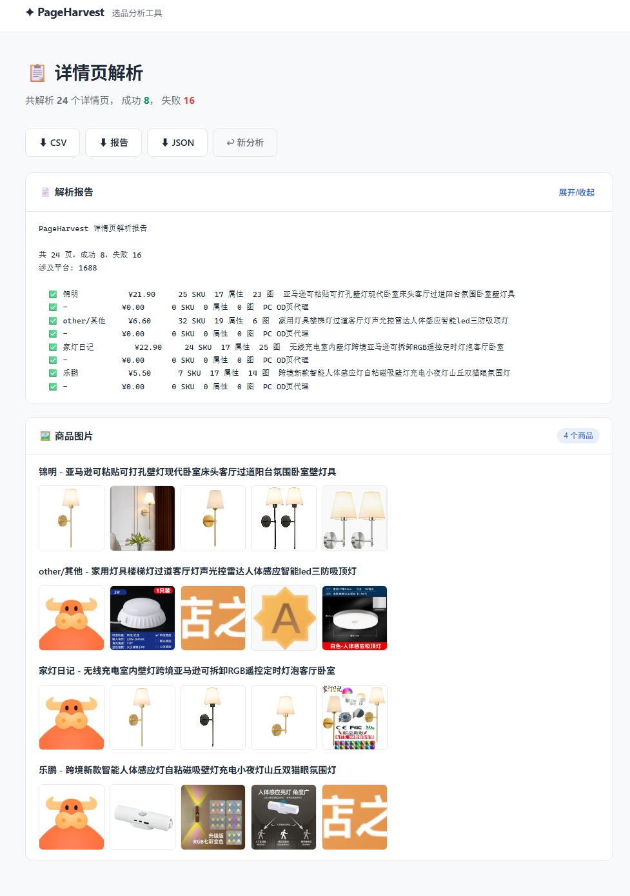

# PageHarvest — 选品分析工具

> 上传平台搜索页/详情页 ZIP → 自动识别 → 输出结构化报告
>
> 三平台（1688 / 震坤行 / 京东）支持。单文件 exe，双击即用，零环境依赖。

---

## 快速开始

### 下载

从 [Releases](https://github.com/w0odst0ck/PageHarvest/releases) 下载 `PageHarvest.exe`

### 启动

双击 `PageHarvest.exe`，浏览器打开 `http://localhost:8080`



### 使用流程

#### 搜索页选品

1. 浏览器安装 [油猴脚本](#-油猴脚本)，在搜索页采集 HTML 数据
2. 把下载的 HTML（或采购助手 XLSX）打包成 ZIP
3. 上传到 PageHarvest → 自动输出选品推荐清单（CSV / TXT / Excel）



#### 详情页解析

1. 浏览器打开商品详情页 → Ctrl+S 保存完整页面
2. 多个页面打包成 ZIP
3. 上传到 PageHarvest → 自动解析品牌/价格/SKU/属性/主图



---

## 油猴脚本

数据采集的第一步依赖浏览器脚本，已发布到 Greasy Fork：

| 脚本 | 安装 | 用途 |
|------|------|------|
| **1688 自动翻页+保存 v1.4** | [安装](https://greasyfork.org/zh-CN/scripts/586397) | 1688 搜索页自动翻页、保存 HTML |
| **震坤行 HTML 下载器 v9.2** | [安装](https://greasyfork.org/zh-CN/scripts/586396) | 震坤行搜索页自动翻页、保存 HTML（SPA 适配 + 手动救援） |

> **京东用户**：由于反爬机制极严，无法通过油猴自动采集。请使用浏览器手动搜索 → 逐页 Ctrl+S 保存 → 打包上传。详情页解析仍支持。

**1688 用户推荐**：安装 [1688采购助手](https://www.1688.com/) 浏览器插件 → 搜索页自动提取数据 → 导出 XLSX → 上传 PageHarvest（数据比 HTML 更完整）。

---

## 输出格式

| 格式 | 内容 |
|------|------|
| **CSV** | 结构化数据，Excel/WPS 可直接打开 |
| **TXT** | 可读报告摘要 |
| **Excel** | 完整解析数据（详情页模式下所有字段展开） |
| **JSON** | 含原始解析数据的完整导出 |

---

## 平台支持

| 平台 | 搜索页选品 | 详情页解析 | 数据获取方式 |
|------|-----------|-----------|------------|
| **1688** | ✅ | ✅ | 油猴脚本 / 采购助手 XLSX |
| **震坤行** | ✅ | ✅ | 油猴脚本 |
| **京东** | ❌ | ✅ | 手动保存 HTML |

---

## 从源码构建

```bash
pip install flask openpyxl beautifulsoup4 pyinstaller
pyinstaller build.spec
# 产物: dist/PageHarvest.exe
```

---

## 项目结构

```
web/              # Flask Web 应用
├── app.py        # 主入口
├── templates/    # HTML 模板
└── static/       # CSS / JS / 图片
api/              # API 路由层
core/             # 核心：统一数据模型、详情页解析注册表
platforms/        # 各平台适配器（1688 / 震坤行 / 京东）
selection/        # 选品分析算法
gap/              # 商品缺口分析
pipeline/         # 命令行管道脚本
```

---

## 技术栈

- **后端**：Python + Flask
- **前端**：原生 HTML / CSS / JS（无框架依赖）
- **解析**：BeautifulSoup + 正则
- **输出**：CSV / TXT / Excel (openpyxl)
- **分发**：PyInstaller 单文件 exe

---

## License

MIT
